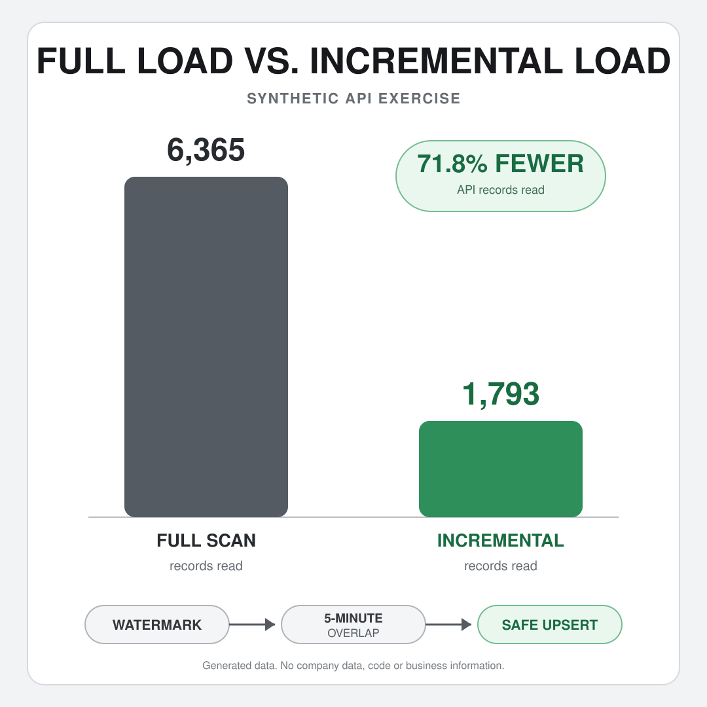

# Exercise 01 · From full API scans to incremental loads

> **A beginner-friendly, reproducible exercise about paginated APIs, incremental loads and the Medallion architecture.**


## 📌 1. Why I built this exercise

Research datasets are often treated as fixed samples: load a file, process the observations and estimate a model. Operational data behave differently. New records arrive, old records may be revised, APIs split results into pages and a pipeline must remember what it has already processed.

This exercise starts with one practical question:

> If an API stores the complete survey history, should the pipeline download that entire history on every run?

A full load is appropriate for the first ingestion and for controlled rebuilds. Repeating it every day, however, wastes requests and processing. An incremental load retrieves only records created or changed since the previous successful run.

The project turns that lesson into a public example with no confidential data, endpoint, credential or business rule.

---

## 🧩 2. The simulated data

The source represents customer-experience survey events from four fictional journey stages: `onboarding`, `service`, `support` and `renewal`.

| Source content | Quantity | Purpose |
| --- | ---: | --- |
| Original responses | 6,000 | Base CX history |
| Later revisions | 352 | Existing answers can change |
| Intentionally invalid events | 25 | Makes validation and quarantine visible |
| Total API events | 6,377 | Originals + revisions + invalid events |

Each event contains a response ID, customer ID, journey stage, response and update timestamps, version, NPS, CSAT, category and comment. NPS follows the 0–10 scale and CSAT follows the 1–5 scale. Invalid events deliberately use an NPS score of 12.

The random seed is fixed. Rebuilding the source therefore produces the same events and expected results every time.

The exercise uses two cutoffs:

| Simulated job | Source cutoff | Role |
| --- | --- | --- |
| Historical run | `2025-09-30T23:59:59Z` | First full load |
| Later run | `2026-01-15T23:59:59Z` | Incremental update |

Only 6,365 of the 6,377 events exist at the second cutoff; 12 later events deliberately remain outside the exercise window.

---

## 💻 3. Local reproduction: detailed guide

### Requirements

- Python 3.11 or newer;
- no third-party Python packages;
- two terminals opened inside `exercise_01_incremental_load`.

On Windows, use `py`. On macOS or Linux, replace `py` with `python3` in the commands below.

### Step 1 · Check Python and the automated tests

```powershell
py --version
py -m unittest discover -s tests -v
```

Six tests should pass. They cover deterministic generation, pagination, overlap, validation, version resolution, idempotent upsert and source persistence.

### Step 2 · Start the simulated source in Terminal 1

```powershell
py setup_synthetic_api.py
```

Expected output:

```text
Synthetic source ready: 6,377 events
API listening at http://127.0.0.1:8765/v1/responses
Keep this terminal open. Press Ctrl+C to stop the API.
```

Terminal 1 now represents an external operational system. It must remain open while the other script makes HTTP requests.

```text
Terminal 1: synthetic API stays online  →  Terminal 2: pipeline calls the API  →  analytical output
```

Optional check: open `http://127.0.0.1:8765/health`. It should return `{"status": "ok"}`. Opening `/v1/responses` directly returns `401 unauthorized` because the data endpoint expects the fictional Bearer token; that is expected.

### Step 3A · Realistic mode: two job executions

Open Terminal 2 and run the historical load:

```powershell
py run_pipeline_local.py --reset --as-of 2025-09-30T23:59:59Z
```

`--reset` deletes only reproducible runtime state and old outputs. The job starts without a watermark, reads every event available at the historical cutoff and commits its first watermark after all pipeline stages succeed.

Check these outputs:

```text
reports/full_2025-09-30.txt
runtime/watermark.json
data/gold/customer_experience_responses.csv
```

Gold should contain 4,315 responses.

Now simulate a later scheduled execution. In the same Terminal 2, run:

```powershell
py run_pipeline_local.py --as-of 2026-01-15T23:59:59Z
```

Do not use `--reset` this time. The script reads the previously committed watermark, applies a five-minute overlap and requests only the incremental window.

```text
Full run  →  commit watermark  →  time passes  →  incremental run reads watermark  →  update Gold
```

Check:

```text
reports/incremental_2026-01-15.txt
reports/load_comparison.txt
data/gold/customer_experience_responses.csv
```

Final Gold should contain 6,000 unique responses.

Why use separate executions? In production, the historical load and the next scheduled job do not occur in the same process. The second execution must prove that state survived the first one.

### Step 3B · Convenience mode: one command

Keep the API running in Terminal 1. In Terminal 2, run:

```powershell
py run_pipeline_local.py --demo
```

```text
--demo  →  reset  →  historical run  →  commit watermark  →  incremental run  →  reports
```

This is one command but still two logical loads. It is useful for demonstrations and automated reproduction; Step 3A better represents two scheduled jobs.

### Step 4 · Stop the source

Return to Terminal 1 and press `Ctrl+C`. The data, database, reports and Gold export remain on disk.

---

## ⚡ 4. Databricks Free Edition reproduction: detailed guide

Free Edition provides serverless compute with usage quotas. This notebook does not download an external dataset: the companion setup notebook generates the source and starts the synthetic API on the notebook process itself. This avoids Free Edition's restricted outbound internet access.

Useful official references:

- [Import and export Databricks notebooks](https://docs.databricks.com/aws/en/notebooks/notebook-export-import)
- [Connect a notebook to serverless compute](https://docs.databricks.com/aws/en/notebooks/notebook-compute)
- [Databricks Free Edition limitations](https://docs.databricks.com/aws/en/getting-started/free-edition-limitations)

### Step 1 · Import both notebooks

1. In the sidebar, open **Workspace**.
2. Create a folder such as `customer-experience-exercise-01`.
3. Inside that folder, choose **Import**.
4. Import `setup_synthetic_api.py` and `run_pipeline_databricks.py`.
5. Confirm that both appear in the same folder.

The first-line marker `# Databricks notebook source` makes Databricks recognize each `.py` file as a source notebook. The pipeline begins with `%run ./setup_synthetic_api`, so the relative location matters.

### Step 2 · Attach serverless compute

Open `run_pipeline_databricks.py`, use the compute selector and choose **Serverless**. Do not install PySpark: it is already supplied by Databricks.

### Step 3 · Create the run-mode dropdown

Run the cell named **Run mode** once. It creates a widget with three choices:

| Mode | What it does |
| --- | --- |
| `full` | Drops previous exercise tables and runs only the historical load |
| `incremental` | Reads the saved watermark and runs only the later load |
| `demo` | Resets and performs both logical loads in one notebook execution |

### Option A · Two separate notebook executions

1. Select `full`.
2. Click **Run all**.
3. Confirm that `cx_ex01_control_watermarks` contains a watermark and `cx_ex01_gold_responses` has 4,315 rows.
4. Change the widget to `incremental`.
5. Click **Run all** again.
6. Inspect `cx_ex01_load_comparison` and confirm that Gold now has 6,000 rows.

```text
Run all: full  →  Delta watermark persists  →  Run all: incremental  →  Delta MERGE updates Silver and Gold
```

This option tests the most important stateful behavior: a new notebook execution can continue from the control table created previously.

### Option B · One notebook execution

1. Select `demo`.
2. Click **Run all**.
3. Wait for the comparison table and Gold preview at the end.

```text
Run all: demo  →  reset tables  →  full load  →  watermark  →  incremental load  →  display results
```

### Tables created

| Managed Delta table | Role |
| --- | --- |
| `cx_ex01_bronze_responses` | Raw API events plus ingestion metadata |
| `cx_ex01_quarantine_responses` | Invalid events and rejection reason |
| `cx_ex01_silver_responses` | One current valid version per response |
| `cx_ex01_control_watermarks` | State used by the next execution |
| `cx_ex01_gold_responses` | Consumption-ready CX table |
| `cx_ex01_load_comparison` | Full-versus-incremental evidence |

The table names are intentionally unqualified so the notebook uses the catalog and schema currently selected in the workspace. The notebook is designed for Free Edition, but its managed-table execution still needs to be confirmed in your own workspace because permissions and platform versions can differ.

---

## 🧭 5. Understanding the code

The project keeps responsibilities visible without splitting one small exercise into many artificial modules:

| File | Single responsibility |
| --- | --- |
| `setup_synthetic_api.py` | Build the deterministic source and expose a paginated API |
| `run_pipeline_local.py` | Execute the complete local pipeline and write local outputs |
| `run_pipeline_databricks.py` | Execute the same logic with Spark and Delta Lake |
| `tests/test_exercise_01.py` | Protect the behaviors most likely to fail silently |

The scripts use numbered section comments, small functions, stable names, retry logic, a control state, quarantine, idempotent upserts and automated tests. These are the same general engineering habits, while this repository remains intentionally smaller because it documents one focused exercise.

### 5.1. Building the synthetic data source

Open `setup_synthetic_api.py` and follow its three numbered code sections:

| Code section | Main functions | What happens |
| --- | --- | --- |
| `1. BUILD THE SYNTHETIC SOURCE` | `generate_responses()`, `write_source()` | Creates originals, revisions and invalid events; writes JSON Lines |
| `2. SERVE THE SOURCE THROUGH A PAGINATED API` | `build_handler()`, `create_server()` | Authenticates, filters and paginates HTTP responses |
| `3. START LOCALLY OR INSIDE DATABRICKS` | `run_locally()`, `start_api_in_background()` | Keeps the API in Terminal 1 or starts it inside Databricks |

JSON Lines stores one JSON event per line. It is simple to regenerate, stream and inspect, and it preserves each source event before validation.

#### 5.1.1. How the synthetic API works

The API exposes two endpoints:

| Endpoint | Authentication | Purpose |
| --- | --- | --- |
| `/health` | None | Confirms that the source is online |
| `/v1/responses` | `Bearer synthetic-demo-token` | Returns filtered, paginated events |

The data endpoint accepts:

| Parameter | Meaning |
| --- | --- |
| `page` | Page to return |
| `page_size` | Records per page, capped at 500 |
| `as_of` | Upper cutoff for `updated_at` |
| `updated_since` | Lower cutoff used by incremental extraction |

The token is deliberately fictional. It demonstrates where authentication belongs without presenting it as production secret management.

#### 5.1.2. Pagination: why one API request is not enough

APIs usually limit how many records they return at once. Reading only page 1 would silently produce an incomplete dataset.

```text
Request page 1  →  save its data  →  read next_page  →  request the next page  →  stop when next_page is null
```

Where it happens:

- local: `extract_responses()` in section `1. EXTRACT` of `run_pipeline_local.py`;
- Databricks: `extract_all_pages()` in section `1. EXTRACT: WATERMARK, OVERLAP AND PAGINATION` of `run_pipeline_databricks.py`;
- API response metadata: `build_handler()` in `setup_synthetic_api.py`.

The historical run requests 19 pages; the incremental run requests 8. The test `test_api_paginates_the_source()` protects the page contract.

### 5.2. Extraction pipeline, step by step

Both implementations follow the same order:

```text
API pages → 🥉 Bronze → validate and resolve versions → 🥈 Silver upsert → 🥇 Gold → commit watermark → reports
                              └─ invalid events → 🔴 Quarantine
```

| Stage | Local code | Databricks code |
| --- | --- | --- |
| Read state and extract all pages | `read_state()`, `extract_responses()` | `read_watermark()`, `extract_all_pages()` |
| Land raw events in Bronze | `run_pipeline()` writes `runtime/bronze/...` | `run_pipeline()` appends `BRONZE_TABLE` |
| Validate and keep the newest batch version | `validate_and_resolve()` | `validate_and_resolve()` |
| Isolate rejected events | `write_jsonl()` to `runtime/quarantine/...` | append to `QUARANTINE_TABLE` |
| Update the trusted current state | `upsert_responses()` | `merge_silver()` |
| Publish the analytical table | `export_gold_csv()` | `publish_gold()` |
| Commit state only after success | `write_json()` inside `run_pipeline()` | `commit_watermark()` inside `run_pipeline()` |
| Save comparison evidence | `save_reports()` | `save_comparison_row()` |

#### 5.2.1. Full load versus incremental load

| Question | Full load | Incremental load |
| --- | --- | --- |
| What is requested? | Every event available at the cutoff | Only events in the watermark window |
| When is it appropriate? | First load, rebuild or recovery | Normal recurring execution |
| State required? | No previous watermark | Previous successful watermark |
| Pages in this exercise | 19 | 8 |
| Rows read | 4,573 | 1,793 instead of 6,365 |

Incremental loading reduces API traffic, network transfer, processing time and pressure on the source system. In this run it avoids reading 4,572 events, a 71.8% reduction relative to another full scan at the later cutoff.

That efficiency is not free: the pipeline must manage state, late arrivals and replays correctly. A full load therefore remains a valid recovery strategy.

#### 5.2.2. Watermark, overlap and idempotency

These three ideas work together:

1. **Watermark** — the greatest `updated_at` safely processed by the previous successful run.
2. **Overlap** — the next query starts five minutes before that watermark, protecting against delayed or boundary events.
3. **Idempotency** — replaying an already processed event does not duplicate or downgrade the target record.

Example from the reports:

```text
previous watermark: 2025-09-30T23:37:00Z
five-minute overlap:                         - 00:05:00
next query starts:    2025-09-30T23:32:00Z
```

The overlap intentionally rereads a small window. The local `ON CONFLICT ... DO UPDATE` and the Delta `MERGE` update a row only when the incoming `updated_at` is newer. This is why the incremental report can show one replayed row without increasing Gold beyond 6,000 unique responses.

The watermark is committed only after extraction, validation, Silver upsert and Gold publication succeed. If an earlier stage fails, the next run can safely retry the same window.

### 5.3. Outputs and reports

This is an ingestion exercise rather than a statistical model, so “post-processing and reporting” is more precise here than “post-estimation.”

#### 5.3.1. What each folder contains after a local run

The [Medallion architecture](https://www.databricks.com/blog/what-is-medallion-architecture) progressively improves data quality from Bronze to Silver to Gold.

| Layer | Meaning | Local implementation | Databricks implementation |
| --- | --- | --- | --- |
| 🥉 Bronze | Raw events as received, with maximum traceability | `runtime/bronze/<run_id>/responses.jsonl` | `cx_ex01_bronze_responses` |
| 🔴 Quarantine | Invalid events kept for diagnosis; not a medal layer | `runtime/quarantine/<run_id>/responses.jsonl` | `cx_ex01_quarantine_responses` |
| 🥈 Silver | Valid, deduplicated current state | `runtime/silver/<run_id>/responses.jsonl` plus SQLite `fact_response` | `cx_ex01_silver_responses` |
| 🥇 Gold | Consumption-ready analytical dataset | `data/gold/customer_experience_responses.csv` | `cx_ex01_gold_responses` |

```text
Bronze preserves what arrived  →  Silver establishes what is trusted  →  Gold publishes what analysis consumes
```

After a complete local run:

```text
exercise_01_incremental_load/
├── data/
│   ├── source/responses.jsonl                 reproducible source
│   ├── gold/customer_experience_responses.csv final analytical output
│   └── DATA_DICTIONARY.md                     field definitions
├── runtime/
│   ├── bronze/<run_id>/responses.jsonl        raw batch
│   ├── silver/<run_id>/responses.jsonl        valid latest batch versions
│   ├── quarantine/<run_id>/responses.jsonl    rejected events
│   ├── customer_experience.db                 current Silver state
│   ├── watermark.json                         state for the next job
│   └── run_history.json                       machine-readable run history
└── reports/
    ├── full_2025-09-30.txt                    historical execution table
    ├── incremental_2026-01-15.txt             incremental execution table
    └── load_comparison.txt                    concise comparison
```

`runtime/` is deliberately ignored by Git because it is regenerated. The synthetic source, final Gold example and TXT reports may be committed as reproducible evidence.

#### 5.3.2. How to read the reports

Each detailed TXT report is grouped by pipeline stage:

| Group | Key questions answered |
| --- | --- |
| `Run` | Which mode and cutoff were used? |
| `Extraction` | How many pages and rows were read or avoided? |
| `State` | Which watermark was read, queried and committed? |
| `Validation` | How many current valid, superseded and invalid events existed? |
| `Upsert` | How many rows were inserted, updated or replayed? |
| `Output` | How many unique responses exist in Gold? |

Expected interpretation:

| Result | Full run | Incremental run |
| --- | ---: | ---: |
| Rows available in a full scan | 4,573 | 6,365 |
| Rows actually extracted | 4,573 | 1,793 |
| API pages | 19 | 8 |
| Rows avoided | 0 | 4,572 |
| Read reduction | 0.0% | 71.8% |
| Valid latest batch versions | 4,315 | 1,699 |
| Quarantined events | 18 | 7 |
| Inserted into Silver | 4,315 | 1,685 |
| Updated in Silver | 0 | 13 |
| Replayed or unchanged | 0 | 1 |
| Final Gold rows | 4,315 | 6,000 |

The incremental arithmetic closes correctly:

```text
1,685 inserted + 13 updated + 1 replayed = 1,699 valid latest batch versions
4,315 previous Gold + 1,685 new IDs = 6,000 final unique responses
```

`load_comparison.txt` is the fastest file to show the efficiency gain. The two detailed reports explain why the row counts changed.

---

## 🛠️ 6. Troubleshooting

| Symptom | Likely cause | Fix |
| --- | --- | --- |
| `API request failed` or `Connection refused` | Terminal 1 is closed | Run `py setup_synthetic_api.py` and keep it open |
| `401 unauthorized` in the browser | Data endpoint was opened without the token | Use `/health`; let the pipeline call `/v1/responses` |
| `Address already in use` | Another API process is already using port 8765 | Stop the older process with `Ctrl+C` |
| A supposed first run is incremental | `runtime/watermark.json` already exists | Run the historical command with `--reset` |
| Comparison report is missing | Only the first load was executed | Run the later incremental command or use `--demo` |
| `ModuleNotFoundError: pyspark` locally | Databricks notebook was run with local Python | Use `run_pipeline_local.py` outside Databricks |
| `%run ./setup_synthetic_api` fails | The notebooks are not in the same workspace folder | Move or re-import both into the same folder |
| Databricks table already has unexpected data | An earlier exercise run remains | Select `full` or `demo`; both reset the exercise tables |
| Free Edition compute becomes unavailable | Daily or monthly quota was reached | Wait for the quota to reset; workspace data are retained |

---

## 🌱 7. What I learned

- An API page is not the complete dataset; pagination must continue until `next_page` is empty.
- A recurring pipeline needs durable state, not only transformation code.
- A watermark reduces the extraction window, while overlap protects its boundary.
- Overlap is safe only when the target operation is idempotent.
- Invalid data should be preserved with a reason instead of silently discarded.
- Bronze, Silver and Gold describe increasing trust and usability, not merely three folder names.
- A full load is still useful for initialization and recovery; the mistake is using it as the default recurring strategy without need.

---

## 🎯 8. Main conclusion

At the later cutoff, another full load would read 6,365 events. The incremental job reads 1,793, avoids 4,572 reads and still produces the correct Gold state with 6,000 unique responses.

> **The valuable lesson is not simply “incremental is faster.” It is that efficiency is reliable only when pagination, watermarking, overlap, validation and idempotent upserts are designed together.**



---

## ⚠️ 9. Limits of the simulation

- The API runs locally and does not reproduce a real network boundary.
- The token is fictional; OAuth, secret rotation and token renewal are outside scope.
- Rate limits, schema drift, source deletions, partial backfills and distributed failures are not simulated.
- The source is small enough for an educational run and is not a performance benchmark.
- SQLite is used for portability, not as a substitute for an enterprise warehouse.
- The Databricks implementation uses Spark and managed Delta tables, but still requires execution in the user's own Free Edition workspace.
- This exercise builds a trusted CX response table; later exercises will address business indicators and analytical modeling.

All records, identifiers, comments, endpoints, credentials and rules were created specifically for this public exercise.
