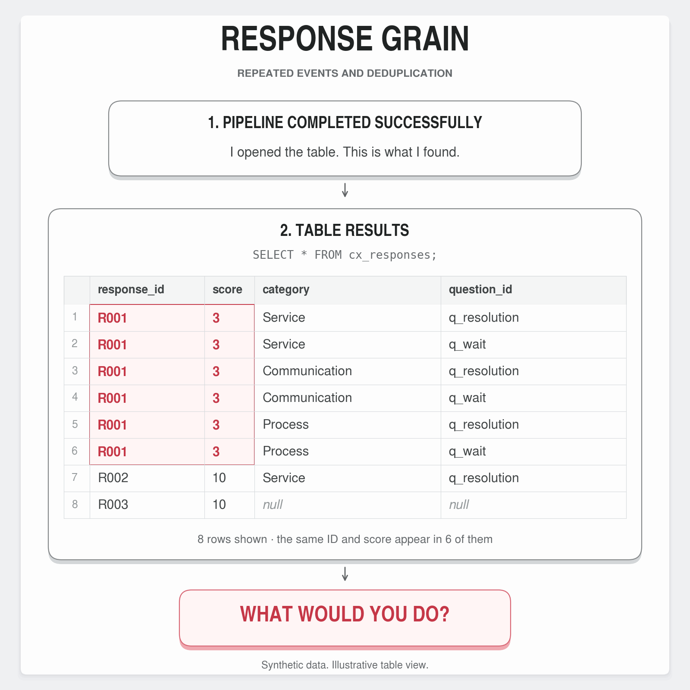

# Exercise 02 · Response grain, repeated events and deduplication

> About a few surprises after the completed pipeline...


## 📌 1. Why I built this exercise

An API-derived CX table can contain the same survey score on several rows because each response
has several classifications and additional questions. Counting those rows as independent answers
changes the metric. This exercise reproduces that pattern with fully synthetic data and separates
join fan-out, repeated deliveries, legitimate revisions and conflicting versions.

<p align="center">
  
  <br>
  <em>Figure 1 – Author's elaboration.</em>
</p>

## 🧩 2. The practical problem

A response with three classifications and two additional questions produces **six rows** when
both child tables are joined directly to the response table. The combinations differ, so a whole-row
`DISTINCT` cannot remove them. Deduplicating only the response ID may discard valid categories.

The remedy used in practice—deduplicate responses and pivot questions—correctly seeks one row per
response for analysis. This exercise retains that useful wide output and makes the underlying model
explicit: **one response fact, a classification bridge and a question-answer table**.

| Observation | Meaning | Treatment |
| --- | --- | --- |
| Same response, different categories/questions | Legitimate 1:N information | Preserve children at their own grain |
| Same business snapshot received again | Repeated event/delivery | Retain receipts; collapse equivalent analytical state |
| Same response, higher source version | Revision | Replace the entire current snapshot, including child removals |
| Same response/version, different contents | Ambiguous source version | Quarantine the version; retain flagged previous valid state |
| Same customer, different responses | Legitimate repeated participation | Preserve both responses |

For response *i*, the two LEFT JOINs create `max(1, C_i) × max(1, Q_i)` rows, after resolving the
current version and duplicate children. The source can also contain repeated deliveries; that is a
separate source of repetition. The diagnostic deliberately isolates the join effect.

### 2.1. The small example behind the figure

| Response | NPS score | Classifications | Additional questions | Rows after LEFT JOINs |
| --- | ---: | ---: | ---: | ---: |
| R001 | 3 | 3 | 2 | 6 |
| R002 | 10 | 1 | 1 | 1 |
| R003 | 10 | 0 | 0 | 1 |
| Total | | | | 8 rows for 3 responses |

Correct NPS: `100 × (2 − 1) / 3 = +33.3`. Counting the joined rows: `100 × (2 − 6) / 8 = −50.0`.
The six rows of R001 do not represent six dissatisfied respondents. Both values use the same
three-response synthetic example; the difference comes only from the counting grain.

NPS uses promoters 9–10, passives 7–8 and detractors 0–6. The illustrative CSAT definition in this
exercise is the share of scores 4–5 on a 1–5 scale. The next exercise covers CX metrics in depth.

The figure shows only the problematic result grid, using four columns from
[micro_before.csv](data/diagnostics/micro_before.csv). The corrected three-response output is in
[micro_after.csv](data/diagnostics/micro_after.csv). The SQL panel is illustrative: `cx_responses`
is a mock table name, not an object created by this exercise. The square design follows the user-supplied
SIGN-RESTRICTED BVAR graphic: compact headings, thin rounded outlines, subtle shadows and red
emphasis on the repeated values.

## 💾 3. What the synthetic source includes

The seed is `20260913`. The generator creates 1,200 background responses plus named edge cases,
for **1,525 delivery receipts** across two batches. It preserves API-like nested categories,
additional questions, arrays, structs, timestamps and contextual metadata. No real endpoint,
token, customer record, identifier or organization-specific transformation is included.

| Case | Fixture evidence |
| --- | --- |
| 3 classifications × 2 questions | `survey-demo / R001` |
| Same snapshot under the same and different event IDs | R001 replay and alias |
| No classifications or questions | R003 |
| Revised score; removed classification and question | R004, versions 1 and 2 |
| Old snapshot arriving after a revision | R004 late receipt |
| Duplicate children; NBSP, zero-width and BOM characters; numeric zero | R005 |
| Empty-value fallback; multi-select and object answers | R006 |
| Different question IDs whose labels sanitize to the same column name | R007 |
| One customer, two legitimate responses | R008 and R009 |
| Conflicting contents at the same version | R010 |
| Timestamp tie resolved by an authoritative source version | R011 |
| Full-snapshot deletion | R012 |
| New question outside the fixed pivot registry | R013 |
| Array of objects with multiple nested options | R014 |
| Equivalent UTC and UTC−3 timestamps | R015 |
| Same response ID in a different survey | `survey-other / R001` |
| Bad scores, timestamps, IDs, missing arrays and child conflicts | BAD001–BAD008 and 20 later revisions |

[scenario_manifest.jsonl](data/source/scenario_manifest.jsonl) identifies the scenario attached to
every receipt. [DATA_CONTRACT.md](docs/DATA_CONTRACT.md) specifies exactly which rules are synthetic
assumptions. In particular, `version` and `eventId` are teaching additions: the historical scripts
do not establish those fields or guarantee full-snapshot semantics.

## 💻 4. Run locally on Windows

Requirements: Python 3.11 or newer. The pipeline and 21 tests use only the standard library.
Extract the review ZIP, enter `exercise_02_deduplication`, then run:

```powershell
py setup_synthetic_data.py
py -m unittest discover -s tests -v
py run_pipeline_local.py --demo
```

On macOS/Linux, substitute `python3` for `py`. No server, account or token is needed. Exercise 01
already covers the HTTP boundary; this exercise consumes a saved deterministic delivery fixture.

The demo resets only `runtime/cx_ex02.sqlite`, runs the initial delivery batch, applies the later
batch, then repeats the later job. It verifies that the replay leaves the analytical output
unchanged and that incremental delivery produces the same final state as a full-history rebuild.

For separate processes, run:

```powershell
py run_pipeline_local.py --reset --batch initial
py run_pipeline_local.py --batch incremental
py run_pipeline_local.py --batch incremental
```

The first job produces 1,217 active responses. The later job produces 1,215: one response is deleted,
and one initially accepted event is removed after a conflicting reuse of its event ID arrives.
The third job remains at 1,215. This decrease is intentional and traceable, not accidental data loss.

The ingestion is incremental; **the small analytical state is recomputed from retained Bronze**.
This favors clear conflict and deletion semantics over performance. It is not a claim of scalable
incremental CDC. Each local publication updates all related SQLite tables in one transaction.

## 📝 5. Output evidence

| Final receipt status | Count |
| --- | ---: |
| Selected current active response | 1,215 |
| Selected current tombstone | 1 |
| Superseded valid version | 153 |
| Repeated equivalent snapshot | 125 |
| Quarantined receipt | 31 |
| Total retained Bronze receipts | 1,525 |

| Output | Rows | Purpose |
| --- | ---: | --- |
| `data/silver/responses.csv` | 1,215 | Main metric calculation |
| `data/silver/response_categories.csv` | 2,490 | All current classification pairs |
| `data/silver/question_answers.csv` | 1,718 | All current additional-question answers |
| `data/gold/responses_wide.csv` | 1,215 | Selected question columns at response grain |
| `data/diagnostics/legacy_join_latest.csv` | 4,479 | Deliberately unsafe join, using the same current responses |

| Metric, full fixture | Correct response grain | Incorrect joined-row grain |
| --- | ---: | ---: |
| NPS | −39.1626 | −63.7745 |
| CSAT top-two score share | 39.7022% | 21.5557% |

The full fixture intentionally gives dissatisfied responses more classifications on average.
These values demonstrate a possible distortion; they are not an estimate of any real business's
error or a general prediction of the direction of bias. The figure uses only the separate small
three-response subset, not these full-fixture metrics.

For details, read [execution_summary.json](reports/execution_summary.json),
[job_runs.json](reports/job_runs.json), [receipt_audit.csv](reports/receipt_audit.csv) and
[quarantine.jsonl](reports/quarantine.jsonl). JSON/CSV exports are reproducible; the SQLite database
is an ignored runtime artifact.

## ⚡ 6. Run in Databricks

1. Create a Workspace folder for Exercise 02 and select a writable catalog/schema.
2. Import `run_pipeline_databricks.py` as a source notebook.
3. Upload `core.py`, `setup_synthetic_data.py`, `run_pipeline_local.py` and `spark_pipeline.py` as
   **Workspace Python files**, in that same folder. They are importable modules, not notebooks.
4. Use compute with PySpark and Delta available. Do not install PySpark inside Databricks.
5. Run the first code cell to create the widgets. Choose `batch=initial`. Use `reset_exercise=yes`
   only when intentionally rebuilding this exercise's objects. Run all cells.
6. Set `reset_exercise=no`, then run with `batch=incremental`. Run incremental once more.
7. Confirm 1,215 active rows in `cx_ex02_responses`, three classifications for `survey-demo / R001`,
   and the same outputs after replay. The notebook compares all four business datasets to the
   Python reference before publication.

The notebook writes `cx_ex02_bronze_receipts` and `cx_ex02_snapshot_bundle` as Delta tables. The
bundle exposes persistent views `cx_ex02_responses`, `cx_ex02_response_categories`,
`cx_ex02_question_answers`, `cx_ex02_responses_wide`, `cx_ex02_audit` and `cx_ex02_quarantine`.
One bundle commit keeps all output datasets aligned to one chosen snapshot. Quarantine payloads
can be retrieved by joining their receipt IDs to Bronze; the local JSONL includes them directly.

Spark transformations were executed locally with **PySpark 3.5.9** and matched the Python reference
for all business rows, audit decisions and quarantine reasons. See
[spark_validation.json](reports/spark_validation.json). **Managed Delta writes, persistent views,
permissions and the notebook's Workspace imports still require validation in your Databricks.**

For optional local Spark verification, install `pyspark==3.5.9` with compatible Java and run
`py validate_spark.py`. Spark is not required for the portable exercise.

## 📖 7. Read the implementation

| File | Responsibility |
| --- | --- |
| `setup_synthetic_data.py` | Build source deliveries and scenario manifest |
| `core.py` | Validate, normalize, resolve versions and define the reference model |
| `run_pipeline_local.py` | Persist Bronze, publish transactional SQLite tables and export evidence |
| `spark_pipeline.py` | Native Spark windows, conflict detection, child tables and fixed pivot |
| `run_pipeline_databricks.py` | Delta ingestion, reference checks and atomic snapshot publication |
| `validate_spark.py` | Optional local Spark-to-reference comparison |
| `tests/test_exercise_02.py` | 21 behavioral, integrity and persistence tests |
| `make_figure.py` | Generate the exact Portuguese/English PNG and SVG figures from exported data |

To regenerate figures, install Matplotlib and run `py make_figure.py` after the demo. Pre-rendered
images are included, so this dependency is optional. The source SVG is provided for editing.

## 👩‍💻 8. Why a bridge plus a pivot?

The pivot is a useful presentation shape. It does not resolve version conflicts or identify which
relationships caused duplication. The classification bridge preserves all legitimate labels, and
the long question table preserves new or complex answers. The fixed pivot is derived afterwards.

Avoid rejoining all children into one metric fact. To filter responses by a classification, use
`EXISTS` or a semi-join. For a main-category metric, deduplicate membership at response/category
grain first: multiple subcategories can otherwise repeat the response within the category. Category
populations overlap, so their totals are not additive. See [ANALYTICAL_QUERIES.sql](docs/ANALYTICAL_QUERIES.sql).

Simply changing the denominator to `COUNT(DISTINCT response_id)` cannot repair an inflated numerator.
Nor does selecting one category arbitrarily preserve a multi-label response.

## ⚠️ 9. Limits and technical references

- This fixture is small, deterministic and intentionally pathological.
- It is not an API emulator, performance benchmark, historical reconstruction or production deployment.
- Driver-side validation, full retained-history recomputation, a single writer and a reviewed question registry are explicit design boundaries.
- Updates are full snapshots, not patches.
- Unknown child arrays are rejected; invalid latest revisions retain the last valid state with a quality flag. See the contract before
reusing the pattern with a real source.

Spark's `max_by` can be nondeterministic for tied ordering values. This exercise handles ambiguous
versions before selecting a winner. See [Apache Spark's max_by documentation](https://spark.apache.org/docs/latest/api/python/reference/pyspark.sql/api/pyspark.sql.functions.max_by.html).

Delta MERGE requires appropriate handling of multiple source matches; the notebook's Bronze merge
operates on unique receipt IDs after collision checks. See [Databricks Delta MERGE](https://docs.databricks.com/aws/en/delta/merge).

Companion modules use [Databricks Workspace Python files](https://docs.databricks.com/aws/en/files/workspace-modules).
The conceptual relationship to Exercise 01 is documented in its
[published README](https://github.com/karinabelarmino/customer-experience-analytics-pipeline/blob/main/exercise_01_incremental_load/README.md).

All public code was written for this exercise. 

## 🌱 7. What I learned

* I need to define what one row represents before deciding which records are duplicates.
* Joining multiple one-to-many relationships can repeat a response and give its score unintended weight in an indicator.
* Deduplicating by response ID too early can discard valid classifications and question answers.
* A pivot makes the data easier to consume, but it depends on clear keys and consistent version-resolution rules.
* Repeated deliveries, revised answers and different responses from the same customer require different treatments.
* A successful execution is only one check. I also need to verify key uniqueness, preservation of valid information and whether rerunning the pipeline leaves the analytical output unchanged.

## 🎯 8. Main conclusion

For the same 1,215 current responses, joining classifications and additional questions produced 4,479 rows. This demonstrates how an incorrect table grain can distort CX indicators even when a pipeline completes successfully.

The final model maintains one row per response, preserves classifications and question answers in separate tables. It also generates the pivoted output for analysis. Explicit rules distinguish repeated deliveries, valid revisions and conflicting versions.

Local tests confirmed that reprocessing does not duplicate the analytical output, while Spark results matched the Python reference. 
> The main lesson is that reliable deduplication starts with defining what each row represents and which information must be preserved.

